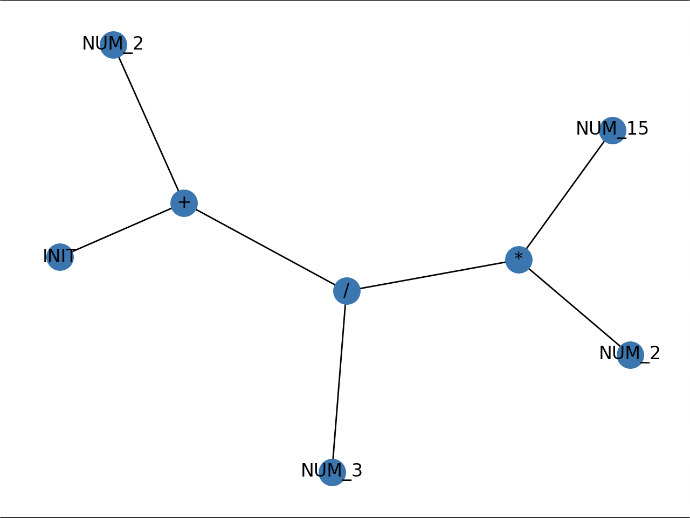

# Graph Demonstrations

In this document, you will be able to use the construction of the parsing tree that evaluates an input in different use cases.

## Use Case 1: Arithmetic (PEMDAS)

Given the input code:

2 + 2 * 15 / 3

The result evaluation is:

12

And the resulting tree is:

## Use Case 2: Function Call

Given the input code:

gen_vector(1,2,3)

The resulting tree is:

## Use Case 3: Variable Assignment

Given the input code:

myNumber = 5

The result evaluation is:

5

And the resulting tree is:

## Use Case 4: Image Flows

Given the input code:

myImg=load_image(“test.jpg”) show_image(myImg)

The output is:

The resulting tree is:

## Use Case 5: Image Filter

Given the input code:

blurredImage = blur(myImg, gen_vector(5,5))

The output is:

The resulting tree is:

## Use Case 6: Conditionals

Given the input code:

IF (10>0) THEN 10 ELSE 0

The result evaluation is:

10

And the resulting tree is:

